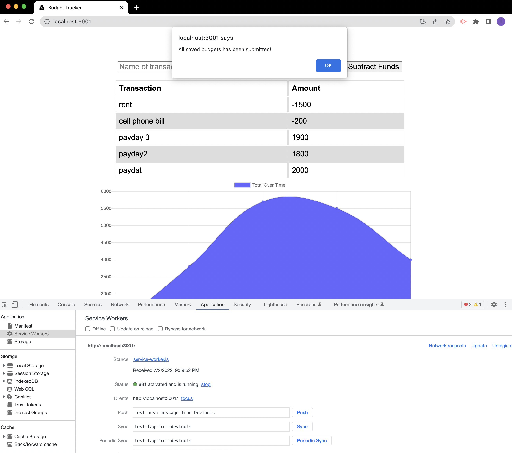

# PWA-Budget-Tracker

## Purpose
In this modules challenge we are assigned to convert a budget tracker with existing code into a PWA that allows offline access and functionality and so that users can add or remove expenses from their budget without internet connection. This will by accomplished by using service workers, cache and indexDB from the browser. 

## Built With 
* HTML
* CSS
* javascript
* Node.js
* mongoDb
* mongoose
* IndexDB
* service workers
* cache
* express.js

## Github Repo
https://github.com/Itzamary/PWA-Budget-Tracker

## Heroku Link

## Image

